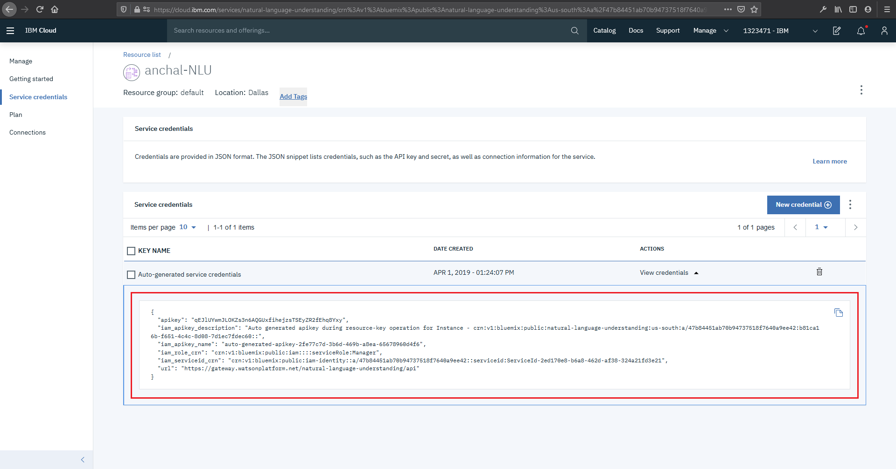
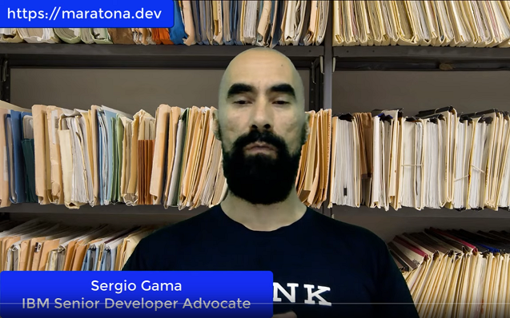

# IBM Christmas Challenge

* [1. Introdução](#1-introdução)
* [2. Desafio](#2-desafio)
* [3. Avaliação](#3-avaliação)
* [4. Requisitos](#4-requisitos)
* [5. Instanciando o *Watson Natural Language Understanding*](#5-instanciando-o-watson-natural-language-understanding)
    * [5.1. Credenciais do *Watson Natural Language Understanding*](#5-1-credenciais-do-watson-natural-language-understanding)
* [6. Treinando um modelo anotador de texto personalizado com *WKS*](#6-treinando-um-modelo-anotador-de-texto-personalizado-com-wks)
* [7. Subindo sua aplicação Node js na nuvem](#7-subindo-sua-aplicação-node-js-na-nuvem)
    * [7.1. Configurando o *IBM Continuous Delivery*](#7-1-configurando-o-ibm-continuous-delivery*)
* [8. Submetendo sua solução](#8-submetendo-sua-solução)

## Para te ajudar

* [Material de Apoio](#material-de-apoio)
* [Troubleshooting](#troubleshooting)
* [License](#license)

## Errata

*Sobre o sistema de pontuação, alguns participantes notaram que havia conflito de informações. Durante a live de lançamento do desafio (você pode revê-la [aqui](https://www.facebook.com/watch/?v=481763842741993)), foi dito que a pontuação limite seria 100, porém notamos que alguns participantes conseguiram notas superiores. O Sistema de pontuação já foi corrida e está atualizada. Para aqueles que já submeteram, seus modelos serão corrigidos pelo sistema novamente, sendo nossa equipe responsável pelo processo. A correção visa a adequação dos limites de pontuação. Caso deseje saber sua nota, você pode submeter novamente e recebê-la. Pedimos desculpas pelo ocorrido e esperamos que não ocorra nenhuma falha daqui em diante. Boas Festas a todos.*

## 1. Introdução

A Natal Corp.(NYSE:SNTK1, NASDAQ:SNTK), desde do ano 374 D.C no ramo de brinquedos, trazendo alegria para as crianças que se comportaram bem durante o ano e buscando sempre inovar seus processos internos, propõem um desafio em conjunto com a IBM, para a comunidade de desenvolvedores ajudar nossa empresa a continuar prestando o excelente serviço que temos prestado a séculos. Os Duendes tem reclamado muito que a quantidade de cartas recebidas é enorme e que a cada ano que passa as horas extras realizadas só aumenta, mesmo com a contratação de novos funcionários. Dentro deste contexto, o desafio é: criar um analisador de cartas com Inteligência Artifical, capaz de extrair informações importantes que possam nos ajudar a cumprir nossa milenar tarefa.

Ho ho ho Feliz Natal! 
Papai Noel 
CEO da Natal Corp.

## 2. Desafio

Para completar o desafio, você irá utilizar a ferramenta *Watson Knowledge Studio* (WKS) para criar o modelo anotador de texto personalizado, e expô-lo via API através do serviço *Watson Natural Language Understanding* (WNLU).

## 3. Avaliação

Você deverá disponibilizar as credencias do *Watson Natural Language Understanding* criado, e o `MODEL_ID` do seu modelo personalizado criado com o *Watson Knowledge Studio*. Uma vez submetido, seu modelo será pontuado por um algoritmo automatizado que irá realizar chamadas para o seu modelo. O pontuador espera receber um JSON com uma lista de entidades identificadas (API padrão do WNLU). A lista de respostas será comparada com um gabarito. Em outras palavras, com a lista de resultados já esperados.

É mandatório criar as **entidades** no `Knowledge Studio` com os seguintes nomes:

- `Nome`
- `Endereco`
- `Motivo`
- `Brinquedo`

E também a **relação**, com o seguinte nome:

- `Deseja` (relação entre as entidades `Nome` e `Brinquedo`)

## 4. Requisitos

Para iniciar o desafio você deverá primeiramente cumprir os seguintes itens:

- Registrar-se na [Página de Cadastro](https://ibm.biz/christmas-challenge).
- Registrar-se na [IBM Cloud](https://ibm.biz/cloud-registro).

## 5. Instanciando o *Watson Natural Language Understanding*

* Acesse o portal Web da IBM Cloud e crie uma instância do serviço [Watson Natural Language Understanding](https://cloud.ibm.com/catalog/services/natural-language-understanding).
* Salve suas credenciais!

### 5.1. Credenciais do *Watson Natural Language Understanding*

🚨 **SALVE AS CREDENCIAIS. VOCÊ PRECISARÁ DELAS PARA SUBIR A APLICAÇÃO** 🚨

Você precisará da credencial `IAM_APIKEY` (ou, em alguns casos, `APIKEY` apenas) e da `URL` do serviço. Para obter ambas, acesse https://cloud.ibm.com/resources e veja a lista de serviços, você encontrará todos os serviços provisionados na sua conta da IBM Cloud. Clique no *Watson Natural Language Understanding* provisionado anteriormente.

Clique na barra lateral esquerda em *service credentials*, conforme mostrado na imagem abaixo.

    

## 6. Treinando um modelo anotador de texto personalizado com WKS

* Crie uma instância de [Watson Knowledge Studio](https://cloud.ibm.com/catalog/services/knowledge-studio), e acesse a plataforma, clicando no botão *"Launch Watson Knowledge Studio"*.
* Descompacte e importe o seu [dataset](doc/dataset) para o processo de `Annotation Task`.
* Faço o treinamento por anotação manual dos documentos.
* Exporte o modelo para o *Watson Natural Language Understanding*.

A API exposta pelo *Watson Natural Language Understanding* utilizará o `MODEL_ID` criado pelo WKS para analisar os textos com base no modelo personalizado, portanto salve seu `MODEL_ID`!

Se precisar de ajuda, veja o vídeo abaixo de como treinar o seu modelo de anotação de texto personalizado usando o `Watson Knowledge Studio`.

    

## 7. Subindo sua aplicação Node js na nuvem

Para subir a aplicação na IBM Cloud, você deve **clicar no botão abaixo**, que irá ativar a ferramenta de *Continuous Delivery* da IBM Cloud (também conhecida como *Delivery Pipeline*).

<b>🚨 CLIQUE PARA SUBIR A APLICAÇÃO NA IBM CLOUD 🚨</b>

### 7.1. Configurando o *IBM Continuous Delivery*

1. Configure o Toolchain Name com o nome `IBM Christmas Challenge`. A região onde sua Toolchain irá rodar fica a sua escolha, recomendamos que use `Dallas`. Com campos preenchidos clique no ícone de `Delivery Pipeline` na parte de baixo da imagem.

2. Preencha o Campo ID para o desafio com o seu ID, você recebeu ele no email que usou para se increver no desafio, procure na sua caixa de entrada um email com assunto `Christmas Challenge - Dados para o desafio`, caso não encontre verifique também sua caixa de spam.

3. Preencha os campos restantes com as credenciais que você guardou ao executar o passo [5.1](#51-credenciais-do-watson-natural-language-understanding). Uma vez com todos os campos preenchidos clique em `Criar`, no canto superior direito.

4. Clique em `Criar` para que seja fazer o deploy da aplicação na sua conta.

5. Neste momento sua Toolchain estará configurada corretamente. Para acompanhar o deploy da aplicação clique em `Delivery Pipeline`.

6. Quando ambos os cartões estiverem com o estágio aprovado sua aplicação estará disponível para uso, basta acessar `<seu-id>`-icc.mybluemix.net, onde `<seu-id>` deve ser o id recebido por email. Caso o processo não inicie automaticamente, clique no botão `Play` do cartão `Build`. Caso ocorra algum erro no processo recomendamos que você tente refazer o porcesso.

## 8. Submetendo sua solução

🚨 **TESTE BASTANTE O SEU MODELO DE TREINAMENTO** 🚨

Mande vários textos para analisar, com base no seu treinamento. Faça quantos testes forem necessários e, se precisar, treine e re-treine o seu modelo para melhorar cada vez mais. Quando se sentir confortável, faça a submissão do seu desafio. Você pode submeter novas soluções quantas vezes desejar -- apenas a submissão com a maior nota será considerada.

Para submeter você deve acessar a aplicação Node.js implantada previamente na nuvem, e clicar no botão para submeter sua solução.

*Obs: Caso queira trocar credenciais, não é necessário um novo deploy para substituir as credencias antigas. Dentro da aplicação no canto superior direito existe um ícone de engrenagem, ao clicar nele você poderá trocar as credencias do NLU e o Model ID sem precisar realizar um novo deploy.*

1. Acesse `<seu-id>`-icc.mybluemix.net, onde `<seu-id>` deve ser subtituído pelo seu id do desafio, o qual você deve ter recebido por email cujo assunto é `Christmas Challenge - Dados para o desafio`. Ao acessar a página você deve visualizar a imagem abaixo.

2. Faça os testes que julgar necessário.

3. Quando se sentir confortável submeta sua solução. Será pedida uma senha, que foi enviada por email junto com seu id, procure na sua caixa entrada e spam por um email cujo assunto é `Christmas Challenge - Dados para o desafio`.

4. Com a submissão realizada você deverá visualizar a mensagem da imagem abaixo.

5. Após alguns segundos você deverá receber sua pontuação na tela conforme a imagem abaixo.

## Material de apoio

- [O que é a IBM Cloud e como subir a sua primeira aplicação na nuvem](https://medium.com/ibmdeveloperbr/o-que-%C3%A9-a-ibm-cloud-e-como-subir-a-sua-primeira-aplica%C3%A7%C3%A3o-na-nuvem-41bfd260a2b7?source=friends_link&sk=7944d2fe14aa940e9bade68ce0731ba0)

## Troubleshooting

1. Caso ocorram erros, nos `Logs` da aplicação uma provável explicação (em vermelho) é apresentada. Use essa informação para descobrir a causa do problema.

## License

Copyright 2019 IBM

   Licensed under the Apache License, Version 2.0 (the "License");
   you may not use this file except in compliance with the License.
   You may obtain a copy of the License at

       http://www.apache.org/licenses/LICENSE-2.0

   Unless required by applicable law or agreed to in writing, software
   distributed under the License is distributed on an "AS IS" BASIS,
   WITHOUT WARRANTIES OR CONDITIONS OF ANY KIND, either express or implied.
   See the License for the specific language governing permissions and
   limitations under the License.
